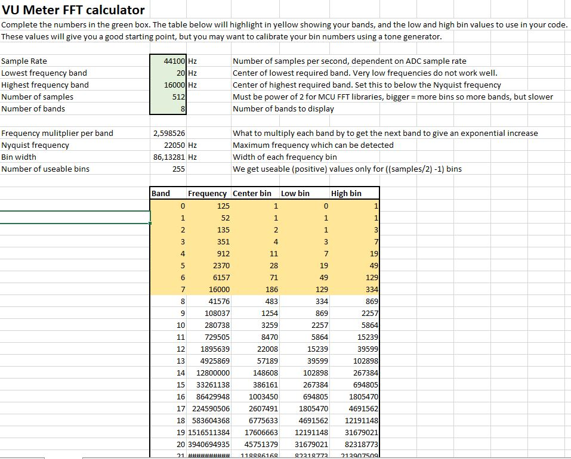
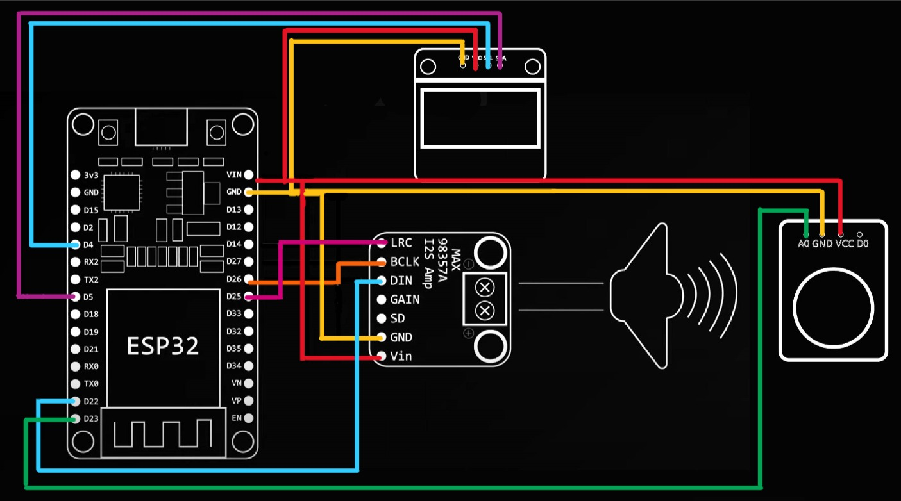
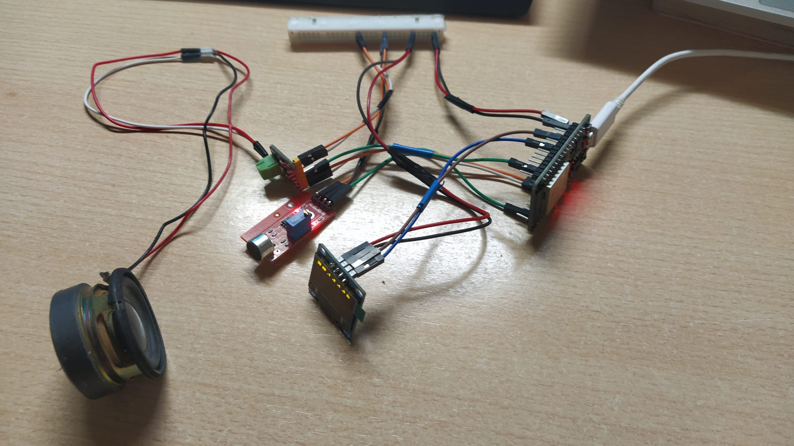

# PROYECTO FINAL:  Espectrograma con bluetooth

- Albert Cambras
- Pau Antón
- Víctor Serrano

## 1.INTRODUCCIÓN

En este proyecto, hemos querido desarrollar muchos de los conceptos aprendidos a lo largo del semestre, ya sean las tareas, redacción de informes markdown o los diversos buses de comunicación, mediante la implementación de un dispositivo relacionado con el ámbito audiovisual. 

Así pues, en primer lugar, nuestro objetivo principal era implementar un ecualizador que se pudiese controlar desde una web HTML para poder nivelar las bandas de frecuencia de una canción reproducida desde el móvil mediante bluetooth. Dado que, a la hora de progresar con esta idea, surgieron algunas dificultades, en especial con las librerías, hemos decidido allanar el camino implementando un analizador espectral, con un display I2C, que represente gráficamente 8 bandas frecuenciales del sonido de entrada captado mediante un micrófono. El sonido en cuestión será la música reproducida desde el móvil a través de una conexión bluetooth establecida entre este y la ESP32, cuya amplificación venga dada por un amplificador de clase D con comunicación I2S. Además, con el objetivo de ser eficientes, utilizaremos ambos núcleos de la ESP32 para distribuir el trabajo eficientemente.

De esta manera, trabajaremos los conocimientos sobre los buses de comunicación I2C, I2S
y uart (indirectamente mediante los Serial.println("")), la distribución de tareas mediante 2 núcleos, HTML y markdown.

## 2.BANDAS FRECUENCIALES



Con el objetivo de programar el display para la creación del espectrograma, hemos buscado información acerca de la librería de Arduino "arduinoFFT.h". Para ello, hemos utilizado un cuaderno de cálculo para conocer un "punto de partida" de los límites denominados "bin", que nos permiten establecer las 8 bandas necesarias para el espectrograma. No obstante, como se puede observar, los valores de la tabla superior no coinciden con los de la programación del display (en el código), ya que necesitábamos acabar de calibrarlos para conseguir un resultado visual óptimo. Es por eso que, anteriormente, hemos denominado a los valores de la tabla como "punto de partida".

## 3.EXPLICACIÓN DEL CÓDIGO

### **LIBRERÍAS** 

Vamos a necesitar las librerías *Adafruit_SSD1306* para la pantalla,*esp32_bt_music_receiver.h* para la conexión Bluetooth y *arduinoFFT* para el cálculo del espectro de frequencias. 

  - arduinoFFT:
  Es una librería creada para calcular la transformada de fourier de un valor con coma flotante. 
  Esta librería no es muy extensa, lo que facilita su uso. 

  Tiene diversas utilidades propias de las transformadas de fourier como *windowing* para disminuir el máximo los errores de transformada, *majorPeakParabola* que caulcula la frecuencia con el pico más elevado, entre algunas otras.

  Link a repositorio:  https://github.com/kosme/arduinoFFT

  - Adafruit GFX y Adafruit_SSD1306:
  Esta es la librería grafica creada por los mismos fabricantes de la pantalla. Está optimizada para que su uso sea sencillo y fácil de usar. 
  
  Esta librería solo contiene las funciones de graficos primitivos: *drawPixel*, *writeLine*, *drawFastVLine*, *drawTriangle*, etc. 

  Link a repositorio: https://github.com/adafruit/Adafruit-GFX-Library

  Por si sola, la librería anterior no funciona. La debemos acompañar con la librería de hardware especifico. En nuestro caso vamos a necessitar la librería Adafruit_SSD1306, utilizada para las pantallas monocromaticas con drivers SSD1306.   

  Link a repositorio: https://github.com/adafruit/Adafruit_SSD1306
    
 - "esp32_bt_music_receiver.h"

 Gracias a la comunidad que tiene Arduino, podemos reducir procesos muy largos de hacer por uno solo y en cambio con la colaboración de diferentes personas se obtienen librerías muy útiles como esta. 
 
 Esta es una librería que nos resultó básica para la parte de envío bluetooth, ya que de una forma muy simplificada y sencilla se podía sacar un gran partido, haciendo la funcionalidad que queríamos desarrollar, enviar datos de música de forma Bluetooth.

Nos da una API de a2DP que recibe datos de sonido desde dispositivos bluetooth mediante un método 'Callback'.
A parte del bluetooth también nos facilita el trabajo del envío a la salida mediante el bus I2S.


### **OBJETOS GENERALES Y PREAMBULO**

Definimos un objeto de la clase Adafruit_SSD1306 que será el display. Lo construimos y pasamos como parametro los pixeles correspondientes de la pantalla (medidas). 

```cpp
#define ANCHO_PANTALLA 128 // ancho pantalla OLED
#define ALTO_PANTALLA 64 // alto pantalla OLED
 
// Objeto de la clase Adafruit_SSD1306
Adafruit_SSD1306 display(ANCHO_PANTALLA, ALTO_PANTALLA, &Wire, -1);
```
Creamos el objeto *FFT* de la clase arduinoFFT. En este caso, no harà falta pasar ningun parámetro para construirlo ya que más adelante le indicaremos como tendrá que hacer la Fast Fourier Transform. 
Aun así, declaramos los parametros de muestras, frecuencia de muestro y la amplitud para poseriormente usarlos. Tambien incializeremos variables para controlar la FFT y los vectores donde se guardaran los datos de la transformada y sus valores maximos. 

```cpp
arduinoFFT FFT = arduinoFFT();
#define SAMPLES 512              // Must be a power of 2
#define SAMPLING_FREQUENCY 44100 // Hz, must be 40000 or less due to ADC conversion time. Determines maximum frequency that can be analysed by the FFT Fmax=sampleF/2.
#define amplitude 200            // Depending on your audio source level, you may need to increase this value
  unsigned int sampling_period_us;
  unsigned long microseconds;

  byte peak[] = {0,0,0,0,0,0,0};
  double vReal[SAMPLES];
  double vImag[SAMPLES];
  unsigned long newTime, oldTime;
  ```
  Finalmente creamos un objeto de bluetooth.

```cpp
 BlootoothA2DSink btdev; 
 ```
 Deberemos nombrar las cabeceras de las funciones que se utilizan en el programa para que sean compliadas. 

 ```cpp
void startOLED(int SDA, int SCL, bool intro);
void startFFT();

void writebands(int x, int y, String txt,int size);
void displayBand(int band, int dsize);

void spectrum_analyzer();

void btTask(void * pvParameters);
```
### **FUNCIONES**

Para hacer el código más maneable hemos creado diversas funciones que son las que van a realizar las tareas más pesadas. De esta manera liberamos el *setup()* y *loop()* de muchas líneas de código. 

  - *startOLED(int SDA, int SCL, bool intro)*

    Esta funcion realiza la conexión I2C con de el display y la ESP32. 

    Toma como parametros los pines *SDA* y *SCL* propios del bus I2C. 
    Además toma otro parámetro de tipo booleano *bool intro* que va a indicar si se omitiran los mensajes de introducción al empezar el programa (false) o no (true).

    Para iniciar el bus I2C en la micro utilizamos
    ```cpp
    Wire.begin(SDA,SDL);
    ``` 

    Tras esto podemos iniciar la pantalla. En caso de no poderse iniciar, se da un mensaje de error y se estanca el programa. 

    ```cpp
    Wire.begin(SDA,SCL); // SDA, SCL

    if (!display.begin(SSD1306_SWITCHCAPVCC, 0x3C)) {
    #ifdef __DEBUG__
    Serial.println("No se encuentra la pantalla OLED");
    #endif
    while (true);
    }
    ```

    Limpiamos el display para evitar solapar píxeles que se hayan escrito anteriormente *display.clearDisplay()* y iniciamos los ajustes necesarios para escribir: 
      ```cpp
      display.setTextSize(2);
      display.setTextColor(SSD1306_WHITE);
      display.setCursor(0, 0);
      ```

    Finalmente acaba escribiendo por pantalla la presentación durante 6 segundos en caso de que el parámetro *intro* = *true*

      ```cpp
      if(intro){
      display.println(" SPECTRUM");
      display.println(" ANALYZER");

      display.setTextSize(1);
      display.println("Made By:");
      display.println("  ALBERT CAMBRAS");
      display.println("  VICTOR SERRANO");
      display.println("  PAU ANTON");
      display.display();
      delay(6000);
      }
      ```


  - *writebands(int x, int y, String txt,int size)* 

    Esta funcion escribirá el texto *txt* de tipo *String* por pantalla en una sola línea. Tiene este nombre porqué más adelante se usará para escribir arriba de todo los diferentes bandas de frecuencia. 

    Esta función es muy sencilla. Simplemente ajusta el tamaño del texto al valor de *int size*, ajusta el cursor a los valores de coordenadas deseadas y finalmente escribe por la pantalla el texto *txt*

    ```cpp
    display.setTextSize(size);
  
    display.setCursor(x, y);
    display.println(txt);
    display.display();
    ```


  - *displayBand(int band, int dsize)*

    Esta es también una funcion tipo *void*. 
    Es usada para dibujar las amplitud de una banda específica.
    Por parámetros le entra el número de la banda que va a respresentar *int band* y la amplitud de la banda de frecuencia *int dsize*.  

    Primero declara una distancia máxima que será el valor de amplitud máxima que se va a representar y luego la limita la amplitud de la banda si ésta es mayor que el máximo. 
    ```cpp
    int dmax = 50;
    if (dsize > dmax) dsize = dmax;
    ```

    Después se dibuja la última banda, correspondiente a los 16k, que no va a aparezer por falta de píxeles 
    ```cpp
    if (band == 7) display.drawFastHLine(18*6,0, 14, SSD1306_WHITE );
    ``` 

    Luego representa las otras 7 bandas. Realiza un bucle para que dibuje una línea horizontal dejando un píxel entre línea y linea. 
    Tal línea horizontal se dibujará a partir de las coordenadas *18*band,64-s* y será de una longitud de 14 píxeles

    ```cpp
    for (int s = 0; s <= dsize; s=s+2){display.drawFastHLine(18*band,64-s, 14,SSD1306_WHITE );}
    ```

    Por último actualiza el pico si este es mas pequeño que el obtenido
    ```cpp
    if (dsize > peak[band]) {peak[band] = dsize;}
    ``` 


  - *spectrum_analyzer()*

    Esta función, también de tipo *void*, realiza la representación completa del espectro de frecuencias. 
    No necesita ningún parámetro de entrada. 

    Empieza limpiando el buffer de la pantalla  y luego escribiendo las diferentes bandas 
    ```cpp
    display.clearDisplay();
    writebands(0,0,".1 .2 .5 1k 2k 4k 8k",1)
    ```

    Tras esto se hace el muestreo de cada para cada una de las 512 muestras. 
    Por cada período de muestreo (1/fs) se toma una muestra des de el pin A0 que esta conectado al micro y se copia en el vector de reales. 

    ``` cpp
    for (int i = 0; i < SAMPLES; i++) {
    newTime = micros()-oldTime;
    oldTime = newTime;
    vReal[i] = analogRead(A0); 
    vImag[i] = 0;
    while (micros() < (newTime + sampling_period_us)) { }
    }
    ```

    Ahora es hora de *"la mágia"*. Hacemos la FFT. Para ello usamos el *windowing()* para pulir los resultados de la transformada, luego hacemos la transformada y finalmente calcula el valor absoluto (amplitud)para todas las muestras. 

    ```cpp
    FFT.Windowing(vReal, SAMPLES, FFT_WIN_TYP_HAMMING, FFT_FORWARD);
    FFT.Compute(vReal, vImag, SAMPLES, FFT_FORWARD);
    FFT.ComplexToMagnitude(vReal, vImag, SAMPLES);
    ```

    Hecha la transformada, se debe representar en el display. Para ello realizamos un bucle que vaya de la 2nda muesta hasta la mitad de las muestras (recordamos que en las transformadas de Fourier la mitad derecha es "un reflejo" de la primera mitad) que son las útiles. 
    Dentro del bucle se hace un filtro de ruido. Tras esto se usa la función *displayBand(int band, int dsize)* para cada banda de frecuencia.
    Por último se dibuja el pico de cada una de las bandas. 

    Cada una de las bandas es la suma de las diferentes "bins" en las que la transformada de fourier coloca los resultados. Para saber los "bins" límites de las bandas utilizaremos el fichero "FFT.xlsx". 

    ```cpp
    for (int i = 2; i < (SAMPLES/2); i++){ // Don't use sample 0 and only first SAMPLES/2 are usable. Each array eleement represents a frequency and its value the amplitude.
        if (vReal[i] > 2000) { // Add a crude noise filter, 10 x amplitude or more
        if (i<2 )              displayBand(0,(int)vReal[i]/amplitude); // 125Hz
        if (i >3   && i<=5  )  displayBand(1,(int)vReal[i]/amplitude); // 250Hz
        if (i >5   && i<=7  )  displayBand(2,(int)vReal[i]/amplitude); // 500Hz
        if (i >7   && i<=15 )  displayBand(3,(int)vReal[i]/amplitude); // 1000Hz
        if (i >15  && i<=30 )  displayBand(4,(int)vReal[i]/amplitude); // 2000Hz
        if (i >30  && i<=53 )  displayBand(5,(int)vReal[i]/amplitude); // 4000Hz
        if (i >53  && i<=200)  displayBand(6,(int)vReal[i]/amplitude); // 8000Hz
        if (i >200) displayBand(7,(int)vReal[i]/amplitude); // 16000Hz
        }
        for (byte band = 0; band <= 6; band++) display.drawFastHLine(18*band,64-peak[band],14, SSD1306_WHITE );
    }
    ```

    Tras esto reduce el pico para que disminuya en 4 píxeles la siguiente vez que sea representado
    ```cpp
    if (millis()%4 == 0) {
        for (byte band = 0; band <= 6; band++) {
            if (peak[band] > 0) peak[band] -= 4;} // Decay the peak
        
    } 
    ```

    Por útlimo ordenamos al display que dibuje todo lo mencionado anteriormente. 

    **El display sólo se actualiza despues de la comanda *display()*.**
    ```cpp
    display.display();
    ```

  
  - *btTask(void * pvParameters)*
    Esta es la función de la tarea Bluetooth y será la encargada de dos cosas:
    -Recibir datos mediante Bluetooth
    -Enviar datos mediante el bus I2S.

    Para realizar esas dos funcionalidades en nuestro caso es muy rápido:
    

    ```cpp
    void btTask (void *parameter){
      btdev.start("bt_speaker"); 
    
    vTaskDelete(NULL);
  }

    ```
    Eso es, simplemente con el objeto creado anteriormente de la clase *BlootoothA2DSink* , empezaremos a poder conectarnos con el dispositivo que querramos al bluetooth de la placa ESP32 y enviar los datos por un bus I2S. Pero realmente vamos a intentar entender de una forma muy por encima que hace esa clase y la función *start("name")* para poderse conectar y empezar a enviar datos.
    
    Una vez entramos a la librería podemos dividir su gran cantidad de funciones en:
    **- Puertos de salida.**  
    **- Start.**  
    **- Funciones llamadas desde Callback.**  
    **- Funcionalidades bluetooth.**

    Vamos a profundizar un poco en los puertos de salida...

    ```cpp
      class BlootoothA2DSink {
      public: 
      BlootoothA2DSink();
      ~BlootoothA2DSink();
      void set_pin_config(i2s_pin_config_t pin_config);
      void set_i2s_port(i2s_port_t i2s_num);
      void set_i2s_config(i2s_config_t i2s_config);

    ```
    Como ya hemos comentado alguna vez, el sonido será sacado por un bus I2S, en nuestro caso vamos a usar un amplificador MAX98357.
    Si no quisieramos establecer una configuración y los pines adecuados para nuestro caso y quisieramos hacerlo por defecto, mediante el contructor obtenemos esa configuración básica por así llamarlo la cuál es:

    ```cpp
    BlootoothA2DSink::BlootoothA2DSink() {
      actualBlootoothA2DSink = this;
      // default i2s port is 0
      i2s_port = (i2s_port_t) 0;

      // setup default i2s config
      i2s_config = {
          .mode = (i2s_mode_t) (I2S_MODE_MASTER | I2S_MODE_TX),
          .sample_rate = 44100,
          .bits_per_sample = (i2s_bits_per_sample_t)16,
          .channel_format = I2S_CHANNEL_FMT_RIGHT_LEFT,
          .communication_format = (i2s_comm_format_t) (I2S_COMM_FORMAT_I2S | I2S_COMM_FORMAT_I2S_MSB),
          .intr_alloc_flags = 0, // default interrupt priority
          .dma_buf_count = 8,
          .dma_buf_len = 64,
          .use_apll = false
      };

      // setup default pins
      pin_config = {
          .bck_io_num = 26,
          .ws_io_num = 25,
          .data_out_num = 22,
          .data_in_num = I2S_PIN_NO_CHANGE
      };

    }
    ```

    Vemos que la configuración nos permite establecer el sample rate, los bits por muestra, la salida mono o estereo, la longitud del buffer de salida además de otras cosas.
    Por otra parte nos fijamos que los pines por defecto establecidos son el 26 para el puerto BCK, 25 para el WS, el 22 para DATA y en el de entrada no lo define y pondremos el que nosotros queramos (3.3V o 5V).
    Luego veremos que esas modificaciones hechas a pin_config, i2s_port.. se van a establecer mediante una función llamada *i2s_driver_install*.

    **Lo siguiente que vamos a ver será la función start.**

    ``` cpp
    void BlootoothA2DSink::start(char* name)
    {
        ESP_LOGD(BT_AV_TAG, "%s", __func__);
        //store parameters
        if (name) {
          this->bt_name = name;
        }
        ESP_LOGI(BT_AV_TAG,"Device name will be set to '%s'",this->bt_name);
        
        // setup bluetooth
        init_bluetooth();
        
        // create application task 
        app_task_start_up();

        // Bluetooth device name, connection mode and profile set up 
        app_work_dispatch(av_hdl_stack_evt_2, BT_APP_EVT_STACK_UP, NULL, 0);

        // setup i2s
        i2s_driver_install(i2s_port, &i2s_config, 0, NULL);

        // pins are only relevant when music is not sent to internal DAC
        if (i2s_config.mode & I2S_MODE_DAC_BUILT_IN) {
          ESP_LOGI(BT_AV_TAG, "Output will go to DAC pins");
          i2s_set_pin(i2s_port, NULL);      
        } else {
          i2s_set_pin(i2s_port, &pin_config);
        }

    }

    ```
    La veremos un poco por encima ya que es una función que no es muy larga pero es compleja...
    Primero usa una biblioteca de registro llamada *ESP_LOGD* que nos serviría para depurar.
    Lo siguiente que hace es mirar si le hemos pasado un nombre válido por parámetro y si es así, se lo asigna a bt_nam, este nombre es el que veremos en nuestro dispositivo al intentar establecer la comunicación y puntero que se define en los parámetros de la clase.

    Y lo siguiente es iniciar el bluetooth.
    Esta función de *init_bluetooth()* lo que hace es ejecutar unas funciones para iniciarlo que le envían parámetros para mirar si la conexión se ha establecido correctamente.
    Para tener los mensajes de información con más rapidez, nos fijamos que se lo envía todo mediante registros.

    La siguiente cosa que hace es crear una tarea controlada llamada *BtApp1*. Una vez creada llama a la función *app_work_dispach*. 
    Finalmente lo que hace es llamar a la función mencionada anteriormente, llamada *i2s_driver_install* que se encarga de aplicar la configuración de la salida I2S.  

    Como ya hemos dicho, es una visión muy general de esta librería a causa de que todavía queda mucho por entender de esta y de conocer en este lenguaje. Además de estas dos funciones explicadas tiene muchas otras para poder llevar a cabo esa comunicación.
    Además de otras para poder llevar a cabo otros temas como la reproducción de sonidos o de canciones pre-guardadas...  
    Si quisieramos acceder a los dartos recibidos en cada momento, el creador de la librería nos deja un pequeñó ejemplo en el README de ella el cuál hace lo siguiente:

    ```cpp
    // In the setup function:
    a2dp_sink.set_stream_reader(read_data_stream);

    // Then somewhere in your sketch:
    void read_data_stream(const uint8_t *data, uint32_t length)
    {
      // Do something with the data packet
    }

    ```

### **SET UP**

En el *setup()* iniciamos la conexión con el puerto serie. 
```cpp
Serial.begin(9600);
```
Utilizamos *startOLED()* para comunicarnos con la pantalla I2C. Pasamos los pines correspondientes a los buses SDA y SDL y el parametro *true* o *false* si queremos o no que se muestre la intro. 
```cpp
 startOLED(5,4, true);
```
Calculamos el período de muestreo en microsegundos. 
```cpp
 sampling_period_us = round(1000000 * (1.0 / SAMPLING_FREQUENCY));
```
Finalmente creamos la tarea *btTask* para que se ejecute la función de Bluetooth en el core 0.

```cpp
 xTaskCreatePinnedToCore(btTask, "btTask", 10000, NULL, 24, NULL,0);
```

### **LOOP** 

Solo debemos llamar a la función *spectrum_analyzer()* para que se ejecute contínuamente.

## 4.ESQUEMA DEL MONTAJE



## 5.FOTO DEL MONTAJE



#### Enlace al vídeo del montaje [aquí](https://www.youtube.com/watch?v=xqxEoIzMi20)

## 6.CONCLUSIÓN

Durante la realización de este proyecto, hemos adquirido valiosos conocimientos. Entre ellos, podríamos destacar la capacidad de no darse por vencido a pesar de la complejidad de adaptar una libreria ajena. También creemos que hemos logrado un dispositivo, cuya función está muy relacionada con la especialidad de nuestro grado.

Por otra parte, consideramos que hemos recabado conocimientos básicos de la asignatura, como la implementación de varios buses de comunicación. Además, hemos ampliado la funcionalidad bluetooth de la placa. Por último, para obtener el máximo rendimiento de nuestra plaquita, decidimos usar ambos núcleos mediante el uso de tareas.

En conclusión, creemos que ha sido un trabajo enriquecedor de cara al futuro, dado que tuvimos que enfrentar adversidades reales del mundo de la ingenieria.

#### *NOTA*: A continuación se expone parte del trabajo realizado para la idea inicial, el final del cual era poco prometedor...

### PARTE Z

Empezamos este proyecto con ganas de llevar a delante una aplicación ya pensada anteriormente por nosotros que era la creación de un dispositivo bluetooth con la capacidad de poder ecualizar de forma digital esos datos y así obtener un sonido de acuerdo al que la persona que pone la música le gustase más.
Ese proyecto lo estuvimos intentando durante unas semanas, llegamos a conclusiones que ni siquiera se nos habían pasado por la cabeza ya que realmente se puede decir que aprendimos mucho intentándolo.
La idea del proyecto era la siguiente:
1. Enviar el sonido desde un dispositivo móvil mediante bluetooth.
2. Crear una API, básica mediante HTML para poder comunicarnos con el oyente y poder proporcionarle los datos del ecualizador.
3. Ecualizar el sonido antes de salir por el altavoz.
4. Establecer la salida mediante un bus I2S.

El primer punto lo obtuvimos nada más empezar, descubrimos varias librerías las cuáles nos permitieran establecer esa conexión bluetooth.  
El segundo punto no había problema ya que anteriormente en un proyecto hecho por aprendizaje, hicimos una base de datos y un código básico HTML para poder apgagar y encender un led.  
En el tercero es donde empezamos a darnos cuenta del tamaño de ese proyecto...  
**Una vez enviados los datos desde el dispositivo móvil y los recibías, ¿como accedes a ellos para poder aplicarles alguna especie de filtro?**  
Parecía intuitivo, nos pusimos manos a la obra y empezamos a buscar que variable hacía de buffer e iba recibiendo y soltando los datos. Encontramos varias hipótesis y finalmente supimos cuál era, pero... **¿cómo le aplicamos el filtro?**  
Estábamos en medio de una librería de 5000 líneas de código, de más de un centenar de funciones, una librería que para poder ser eficiente con el envío de datos trabajaba solamente con púnteros, variables de 8 bits, de 16, nosotros no estábamos nada acoastumbrados a trabajar con estructuras de datos de tal nivel.  
Teníamos la variable, teníamos la forma de jugar con ella así que pensamos en que deberíamos hacer tres filtros:

- filtro paso bajas
- filtro paso banda
- filtro paso altas  

Hemos estado este último año estudiando la creación de filtros, tanto analógicos como digitales así que teníamos los fundamentos para crearlos. Dijimos de hacer un filtro IIR, para poder obtener un orden bajo sin que la calidad del filtro sea tan mala y poder tener un código eficaz.

Para obtener los coeficientes del filtro usamos dos herramientas, MATLAB y transformada bilineal de diferentes filtros que sabíamos que eran de esos tres tipos.  


Una vez calculados los filtros faltaban dos cosas:
- Ecuación en diferencias del filtro hecha en código.
- Aplicarle esa ecuación de diferencias a nuestras muestras.  
Antes de intentar hacerlo con el método que pensábamos de aplicar un bucle for e ir jugando con las diferentes muestras, quisimos mirar por internet porque no sabíamos si sería lo más rápido posible.
Pero efectivamente encontramos una persona que había aplicado ese criterio, el código es el siguiente:

```cpp
struct iir_filt {
   float in_z1;
   float in_z2;
   float out_z1;
   float out_z2;
   float a0[4];
   float a1[4];
   float a2[4];
   float b1[4];
   float b2[4];  
};


//bass-speaker, 45Hz Hipass
static struct iir_filt conf_45_hp = {
	//index0 = 16k, index1 = 32k, index 2 = 44k1, index 3 = 48k
	.a0 = { 0.9875820178250215, 0.9937716134506484 , 0.9954766638878052, 0.9958434200204267 },
	.a1 = { -1.975164035650043, -1.9875432269012967, -1.9909533277756104,  -1.9916868400408534 },
	.a2 = { 0.9875820178250215, 0.9937716134506484, 0.9954766638878052, 0.9958434200204267 },
	.b1 = { -1.975009826344679, -1.9875044344654942, -1.9909328674920315, -1.9916695631391037 },
	.b2 = { 0.9753182449554073, 0.9875820193370991, 0.9909737880591895, 0.991704116942603 },
	
}; 	


//bass-speaker, 2500Hz Lowpass
static struct iir_filt conf_2k5_lp = {
	//index0 = 16k, index1 = 32k, index 2 = 44k1, index 3 = 48k
	.a0 = { 0.13993146179027674, 0.044278036805267616, 0.025175362450974036, 0.021620113635254866 },
	.a1 = { 0.2798629235805535, 0.08855607361053523, 0.05035072490194807, 0.04324022727050973 },
	.a2 = { 0.13993146179027674, 0.044278036805267616, 0.025175362450974036, 0.021620113635254866 } ,
	.b1 = { -0.699698900564656, -1.3228374096880198, -1.50365042037159, -1.5430779694435248 },
	.b2 = { 0.259424747725763, 0.4999495569090904, 0.6043518701754859, 	0.6295584239845442}
	
}; 	

//bass-speaker, eq 60Hz +5db, q=2.0, bass fun factor :-)
static struct iir_filt conf_60_eq = {
	//index0 = 16k, index1 = 32k, index 2 = 44k1, index 3 = 48k
	.a0 = { 1.0045571784556593, 1.0022854380342285, 1.00165972312044, 1.0015251377673262 },
	.a1 = { -1.9877372051598552, -1.9939885650528055, -1.995661969908465, -1.9960191810845285 },
	.a2 = { 0.9837319156746053, 0.991841509165585, 0.994075168233407, 0.9945556071485654 },
	.b1 = { -1.9877372051598552, -1.9939885650528055, -1.995661969908465, -1.9960191810845285 },
	.b2 = { 0.9882890941302647, 0.9941269471998133, 0.9957348913538471, 0.9960807449158914 }
	
}; 	


//tweeter 2800 Hz Hipass
static struct iir_filt conf_2k8_hp = {
	//index0 = 16k, index1 = 32k, index 2 = 44k1, index 3 = 48k
	.a0 = {  0.44599764558093963, 0.6764097852300075, 0.753716633131342, 0.7713299340241907},
	.a1 = { -0.8919952911618793, -1.352819570460015, -1.507433266262684, -1.5426598680483814},
	.a2 = { 0.44599764558093963, 0.6764097852300075, 0.753716633131342, 0.7713299340241907},
	.b1 = { -0.5570289325445305, -1.2452156906579934, -1.4458299168752424, -1.489668635259956},
	.b2 = { 0.2269616497792281, 0.4604234502620365, 0.5690366156501254, 0.595651100836807}
	
}; 		
uint8_t fs2;

static float process_iir (float inSampleF, struct iir_filt * config) {
	float outSampleF =
	(* config).a0[fs2] * inSampleF
	+ (* config).a1[fs2] * (* config).in_z1
	+ (* config).a2[fs2] * (* config).in_z2
	- (* config).b1[fs2] * (* config).out_z1
	- (* config).b2[fs2] * (* config).out_z2;
	(* config).in_z2 = (* config).in_z1;
	(* config).in_z1 = inSampleF;
	(* config).out_z2 = (* config).out_z1;
	(* config).out_z1 = outSampleF;
	return outSampleF;
}


static void process_data (int16_t * data, size_t item_size) {
	
	int16_t * samples = data;
	int16_t * outsample = data;
	
	for (int i=0; i<item_size; i=i+4) {
		//restore input samples and make monosum
		float insample = (float) *samples;
		samples++;
		insample += *samples;
		samples++;
		//monosum now available in insample
		
		//process bass speaker
		float lowsample = process_iir(insample, &conf_45_hp);
		lowsample = process_iir(lowsample, &conf_2k5_lp);
		lowsample = process_iir(lowsample, &conf_60_eq);
		//process tweeter
		float highsample = process_iir(insample, &conf_2k8_hp);
		
		
		//restore two outputsamples lowsample & highsample to outputbuffer
		*outsample = (int16_t) lowsample;
		outsample++;
		// *outsample = (int16_t) highsample;
		outsample++;		
	
	}

*data= *outsample;

}
```
En el momento de verlo empezamos a darnos cuenta que era tal cuál nosotros lo habíamos planteado.
En el código crea una tupla en la cuál guarda los coeficientes de ese filtro, una variable con las muestras de entrada y otras de salida, por lo que vemos que es un filtro IIR.
Además de esa tupla genérica, establecía diferentes configuraciones de esta, una para un filtro de frecuencias de corte x y otro para frecuencia de corte y. Una vez visto esto de verdad que pensábamos que lo teníamos y que íbamos a poder acabar ese proyecto que además teníamos ganas desde hacía tiempo de conseguirlo...
La función process_data tiene un funcionamiento muy básico, lee el parámetro de entrada y lo multiplica por el coeficiente del filtro de esa muestra, podríamos dibujarlo de forma fácil.  
  
Finalmente, una vez creados los filtros que deseábamos, calculando los coeficientes de estos, solo hacía falta crear una especie de librería llamada 'filter' y agregarla en la librería que estábamos usando para enviar los datos de forma bluetooth. Aquí fue cuando ya nos dimos cuenta que este proyecto no se podía conseguir en cuestión de un mes con todos los examenes por delante porque la recerca de todo ese proceso y el aprendizaje obtenido hasta ese punto había agotado el tiempo de la entrega ya que una vez hecha la librería, empezamos a tener errores por todo el código no creado por nosotros si no de la misma librería bluetooth, cuando lo único que hacíamos era insertar la librería. Incluso dijimos de quitar la funcionalidad bluetooth para poder trabajar con la librería **Audio de esp32** ya que era más intuitiva y parecía más eficiente...Igualmente estuvimos unos días solucionando esos problemas ya que parecían irrelevantes y rápidos de solucionar pero nos estábamos quedando sin tiempo y no queríamos entregar un proyecto a medio hacer, tuvimos que ser realistas con nosotros mismos y tener un punto crítico por lo que decidimos hacer el proyecto **ANALIZADOR DE ESPECTRO BLUETOOTH** y dejar este proyecto que habíamos estado investigando y aprendiendo con él para el verano. 